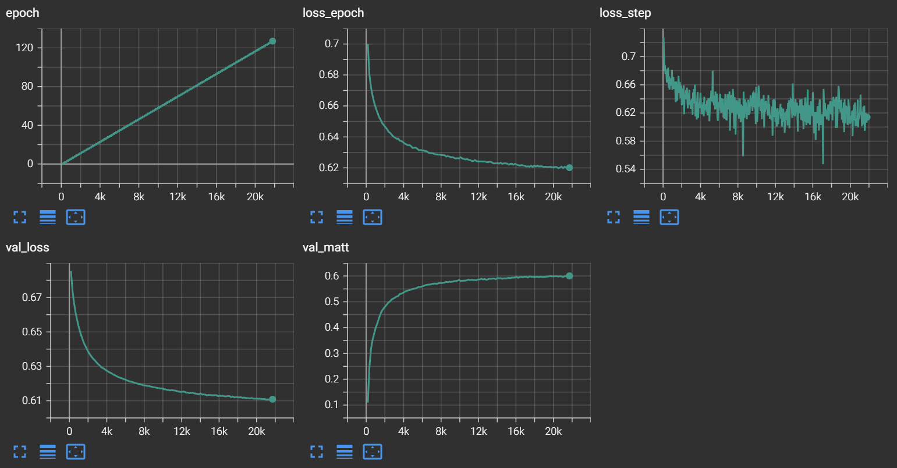
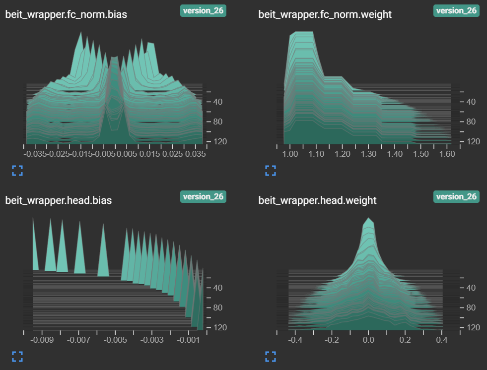

# BEiT-3 Fake image detection
[BEiT-3](https://arxiv.org/abs/2208.10442) is a foundation model that can be fine-tuned to detect fake images with a classification head.
* [Report](report.pdf)
* [Predictions](predictions.csv)

## Training and evaluation
Use https://colab.research.google.com/github/ with "Include private repos" to run [fake_image_detection.ipynb](fake_image_detection.ipynb)

## Dataset
[generate_balanced_dataset.py](generate_balanced_dataset.py) was used to generate a balanced train dataset:
https://www.kaggle.com/datasets/dmitryvinnik/artifact-60k-balanced

The predictions are provided for https://www.kaggle.com/datasets/dmitryvinnik/rd-predict-dataset

## Plots

